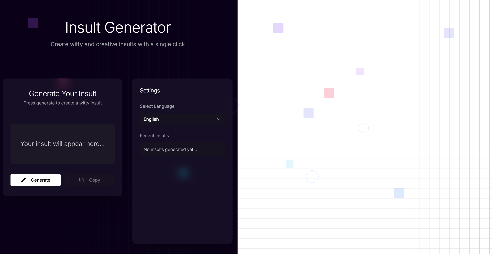

# 🤬 Insult Generator

A modern web application that generates creative insults in multiple languages. Built with React, TypeScript, and Tailwind CSS.



## 🌟 Features

- Generate witty insults in multiple languages
- Copy insults to clipboard
- View insult history
- Responsive design
- Animated UI elements


## 🛠️ Tech Stack

- **Frontend Framework:** React with TypeScript
- **Styling:** Tailwind CSS
- **State Management:** React Hooks
- **UI Components:** Shadcn/ui
- **Animations:** Canvas Confetti
- **API Integration:** Evil Insult Generator API

## 🚀 Getting Started

### Prerequisites

- Node.js (v16 or higher)
- npm or yarn

### Installation

1. Clone the repository:
```bash
git clone https://github.com/RaHasib/insultGenerator.git
cd insult-generator
```

2. Install dependencies:
```bash
npm install
# or
yarn install
```

3. Create a `.env` file in the root directory:
```bash
VITE_API_BASE_URL=https://evilinsult.com
VITE_MAX_HISTORY=5
VITE_DEFAULT_LANGUAGE=en
```

4. Start the development server:
```bash
npm run dev
# or
yarn dev
```

## 🌍 Available Languages

- English (en)
- Spanish (es)
- French (fr)
- German (de)

## 📝 License

This project is licensed under the MIT License - see the [LICENSE](LICENSE) file for details.

## 🙏 Acknowledgments

- [Evil Insult Generator API](https://evilinsult.com) for providing the insult generation service
- [Shadcn/ui](https://ui.shadcn.com/) for the beautiful UI components
- [Canvas Confetti](https://www.npmjs.com/package/canvas-confetti) for the celebration effects

---